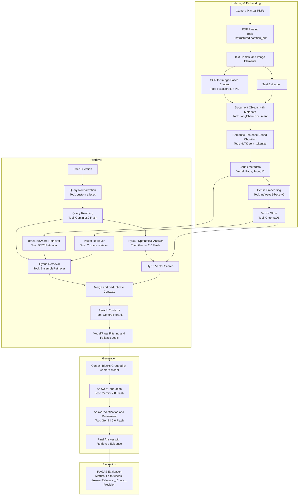

# Camera Manual RAG System

A retrieval-augmented generation (RAG) system for answering natural-language questions about Olympus / OM System camera operation manuals.

## Project Overview

Camera manuals are long, technical, and difficult to search when users need a specific operation quickly. This project builds an end-to-end RAG assistant that retrieves relevant passages from camera manuals and generates grounded answers for user questions such as enabling silent shooting, using Face Priority AF, connecting Wi-Fi, formatting memory cards, and finding ISO or self-timer settings.

## Key Features

- Parses camera manuals from PDF files using `unstructured` high-resolution PDF partitioning.
- Extracts both text and image-based content with OCR via `pytesseract`.
- Applies semantic sentence-based chunking to preserve context quality.
- Creates dense embeddings with `intfloat/e5-base-v2`.
- Stores manual chunks in a Chroma vector database.
- Combines BM25 keyword retrieval with vector retrieval using a hybrid retriever.
- Uses HyDE-style hypothetical document embeddings to improve retrieval.
- Applies Cohere reranking to prioritize the most relevant contexts.
- Generates final answers with Gemini 2.0 Flash.
- Evaluates the RAG pipeline using RAGAS metrics.

## RAG Pipeline



### Pipeline Tools and Design Considerations

| Stage | Tools | What It Does | Design Considerations |
|---|---|---|---|
| PDF ingestion | Olympus / OM System manuals, Google Colab upload | Loads camera manuals as the knowledge source. | Manuals are long and technical, so the system needs source-grounded retrieval rather than relying on a general LLM. |
| PDF parsing | `unstructured.partition_pdf`, high-resolution strategy | Splits manuals into text, tables, and image-like elements. | Camera manuals contain mixed content, so parsing needs to preserve structure and page-level context. |
| OCR | `pytesseract`, `PIL` | Extracts text from image-based manual sections. | Some instructions appear inside diagrams or screenshots; OCR increases retrievable coverage. |
| Document construction | LangChain `Document` | Wraps extracted content with metadata such as camera model, page number, and content type. | Metadata makes answers traceable and supports model-specific filtering. |
| Semantic chunking | `nltk.sent_tokenize`, custom chunking function | Groups sentences into coherent chunks based on word count. | Sentence-based chunking preserves meaning better than arbitrary character splitting. |
| Embedding | Hugging Face `intfloat/e5-base-v2` | Converts chunks into dense vectors for semantic retrieval. | Dense embeddings help find relevant passages even when the user's wording differs from the manual. |
| Vector storage | ChromaDB | Stores embedded manual chunks for similarity search. | Persisted vector storage avoids rebuilding the index every session. |
| Query normalization | Custom alias and normalization logic | Standardizes model names and query wording. | Users may type `om1`, `OM-1`, or `E-M1 mark ii`; normalization improves matching. |
| Query rewriting | Gemini 2.0 Flash | Rewrites the user question into a clearer retrieval query. | Better query phrasing improves both BM25 and vector retrieval. |
| Hybrid retrieval | LangChain `BM25Retriever`, vector retriever, `EnsembleRetriever` | Combines keyword and semantic retrieval. | BM25 catches exact technical terms; vector search captures semantic similarity. |
| HyDE retrieval | Gemini + embedding model | Generates a hypothetical manual-like answer and retrieves chunks similar to it. | HyDE helps when the user's query is short, vague, or phrased differently from the manuals. |
| Deduplication | Python metadata/content keys | Removes repeated retrieved chunks. | Camera manuals repeat similar sections, so deduplication reduces noisy context. |
| Reranking | Cohere `rerank-english-v3.0` | Reorders candidate contexts by relevance. | Reranking improves context precision before generation. |
| Context assembly | Custom grouping by camera model | Groups retrieved passages by model and page. | Model grouping helps answer model-specific or comparison questions. |
| Answer generation | Gemini 2.0 Flash | Produces the final answer using retrieved context only. | Prompting emphasizes grounded answers and asks the model to say when the answer is not found. |
| Verification/refinement | Gemini 2.0 Flash | Checks and refines the generated answer. | This step reduces unsupported claims and improves clarity. |
| Evaluation | RAGAS, OpenAI `gpt-4o-mini` evaluator | Measures faithfulness, answer relevancy, and context precision. | Reference-free metrics fit this project because manual QA pairs did not have gold answers. |

### Key Architectural Choices

- **Hybrid retrieval instead of vector-only retrieval:** Technical manuals contain exact terms, menu labels, and model names. BM25 helps capture these literal matches while vector retrieval handles paraphrased questions.
- **Semantic chunking instead of fixed character splitting:** Manual instructions often span multiple sentences. Sentence-aware chunks reduce fragmented context.
- **Metadata-rich chunks:** Model and page metadata make outputs more explainable and help filter results when users ask about a specific camera.
- **Reranking after retrieval:** Initial retrieval can include repeated or weakly related passages. Reranking improves the quality of the final context window.
- **RAGAS evaluation:** The project evaluates retrieval and generation quality with measurable metrics rather than only showing sample answers.

## Tech Stack

- Python
- Google Colab
- LangChain
- ChromaDB
- Hugging Face sentence-transformers
- BM25 / rank_bm25
- Cohere Rerank
- Gemini API
- OpenAI API for RAGAS evaluation
- RAGAS
- unstructured
- pytesseract / OCR

## Repository Structure

```text
camera-manual-rag-system/
├── README.md
├── requirements.txt
├── .gitignore
├── notebooks/
│   ├── camera_manual_rag_clean.ipynb
│   └── camera_manual_rag_with_results.ipynb
├── data/
│   └── README.md
├── outputs/
│   └── evaluation_summary.md
└── docs/
    ├── github_publish_checklist.md
    ├── github_repository_setup.md
    └── notion_portfolio_copy.md
```

## Notebook Versions

- `camera_manual_rag_clean.ipynb`: GitHub-friendly version with outputs and execution counts removed.
- `camera_manual_rag_with_results.ipynb`: portfolio version that keeps key outputs, including generated answers and RAGAS evaluation results, while removing installation logs and long download widgets.

## Evaluation Results

The RAG system was evaluated with RAGAS on 13 camera-operation questions.

| Metric | Score | Interpretation |
|---|---:|---|
| Context Precision | 0.8510 | Strong retrieval of relevant manual passages. |
| Answer Relevancy | 0.8499 | Generated answers were highly relevant to user questions. |
| Faithfulness | 0.7614 | Most answers were grounded in retrieved manual content, with room for improvement. |

## Important Notes Before Publishing

This portfolio copy does not include the generated Chroma vector database because it is large and can be rebuilt from the notebook. The original manual PDFs should only be published if their redistribution rights are confirmed. A safer GitHub approach is to describe the data source and provide instructions for users to place manuals in a local `data/raw/` folder.

API keys should never be committed. Use environment variables or Colab secrets for `GEMINI_API_KEY`, `COHERE_API_KEY`, and `OPENAI_API_KEY`.

## Portfolio Summary

Built an end-to-end RAG pipeline for technical camera manuals, combining OCR, semantic chunking, dense vector search, BM25 retrieval, HyDE query expansion, reranking, Gemini answer generation, and RAGAS evaluation. The system achieved strong retrieval and answer relevance while surfacing key limitations around visual symbols and multimodal manual understanding.
