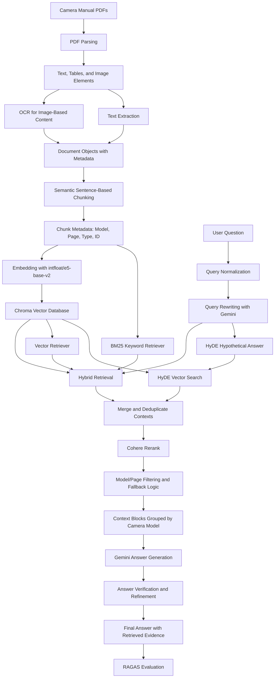

# RAG Pipeline Diagram

This document visualizes the end-to-end RAG workflow used in the Camera Manual RAG System, including the tools used at each stage and the design considerations behind them.

## End-to-End Workflow

## Step-by-Step Explanation

| Stage | Tools | What It Does | Design Considerations |
|---|---|---|---|
| PDF ingestion | Olympus / OM System manuals, Google Colab upload | Loads camera manuals as the knowledge source. | Manuals are long and technical, so the system needs source-grounded retrieval rather than relying on a general LLM. |
| PDF parsing | `unstructured.partition_pdf`, high-resolution strategy | Splits manuals into text, tables, and image-like elements. | Camera manuals contain mixed content, so parsing needs to preserve structure and page-level context. |
| OCR | `pytesseract`, `PIL` | Extracts text from image-based manual sections. | Some instructions appear inside diagrams or screenshots; OCR increases retrievable coverage. |
| Document construction | LangChain `Document` | Wraps extracted content with metadata such as camera model, page number, and content type. | Metadata makes answers traceable and supports model-specific filtering. |
| Semantic chunking | `nltk.sent_tokenize`, custom chunking function | Groups sentences into coherent chunks based on word count. | Sentence-based chunking preserves meaning better than arbitrary character splitting. |
| Embedding | Hugging Face `intfloat/e5-base-v2` | Converts chunks into dense vectors for semantic retrieval. | Dense embeddings help find relevant passages even when the user's wording differs from the manual. |
| Vector storage | ChromaDB | Stores embedded manual chunks for similarity search. | Persisted vector storage avoids rebuilding the index every session. |
| Query normalization | Custom alias and normalization logic | Standardizes model names and query wording. | Users may type `om1`, `OM-1`, or `E-M1 mark ii`; normalization improves matching. |
| Query rewriting | Gemini 2.0 Flash | Rewrites the user question into a clearer retrieval query. | Better query phrasing improves both BM25 and vector retrieval. |
| Hybrid retrieval | LangChain `BM25Retriever`, vector retriever, `EnsembleRetriever` | Combines keyword and semantic retrieval. | BM25 catches exact technical terms; vector search captures semantic similarity. |
| HyDE retrieval | Gemini + embedding model | Generates a hypothetical manual-like answer and retrieves chunks similar to it. | HyDE helps when the user's query is short, vague, or phrased differently from the manuals. |
| Deduplication | Python metadata/content keys | Removes repeated retrieved chunks. | Camera manuals repeat similar sections, so deduplication reduces noisy context. |
| Reranking | Cohere `rerank-english-v3.0` | Reorders candidate contexts by relevance. | Reranking improves context precision before generation. |
| Context assembly | Custom grouping by camera model | Groups retrieved passages by model and page. | Model grouping helps answer model-specific or comparison questions. |
| Answer generation | Gemini 2.0 Flash | Produces the final answer using retrieved context only. | Prompting emphasizes grounded answers and asks the model to say when the answer is not found. |
| Verification/refinement | Gemini 2.0 Flash | Checks and refines the generated answer. | This step reduces unsupported claims and improves clarity. |
| Evaluation | RAGAS, OpenAI `gpt-4o-mini` evaluator | Measures faithfulness, answer relevancy, and context precision. | Reference-free metrics fit this project because manual QA pairs did not have gold answers. |

## Key Architectural Choices

- **Hybrid retrieval instead of vector-only retrieval:** Technical manuals contain exact terms, menu labels, and model names. BM25 helps capture these literal matches while vector retrieval handles paraphrased questions.
- **Semantic chunking instead of fixed character splitting:** Manual instructions often span multiple sentences. Sentence-aware chunks reduce fragmented context.
- **Metadata-rich chunks:** Model and page metadata make outputs more explainable and help filter results when users ask about a specific camera.
- **Reranking after retrieval:** Initial retrieval can include repeated or weakly related passages. Reranking improves the quality of the final context window.
- **RAGAS evaluation:** The project evaluates retrieval and generation quality with measurable metrics rather than only showing sample answers.

## Limitations and Future Improvements

- The system is mostly text-based, so it struggles with visual symbols and interface icons in camera manuals.
- Repeated sections across different camera modes can confuse retrieval.
- A multimodal RAG approach could improve interpretation of diagrams, icons, screenshots, and menu navigation visuals.
